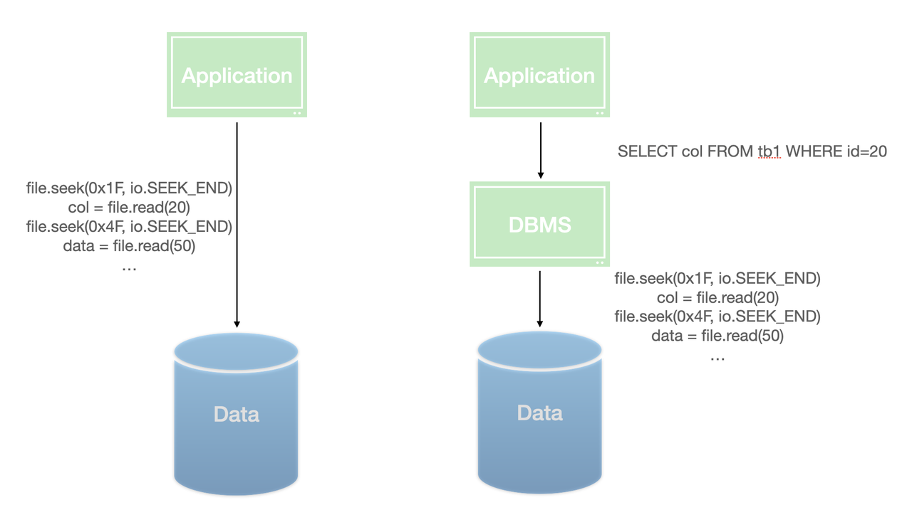

\newpage{}

# 查询语言 {#query-language}

## 数据模型与查询语言 {#query-language-and-data-models}

**要设计一个数据库系统，第一步就是设计其对外的接口——外界要如何操作数据库中的数据，如何查找数据？**

要解决这个问题，首先要定义一种数据模型。

数据模型主要包括两个部分：**其一，其定义了数据在数据库中的逻辑表示，其二，其定义了外界操作数据的法则。**

数据模型的意义在于，通过定义一套数据模型，我们可以用指定的语言描述我们想要的数据，剩下的工作就全部可以交给数据库系统进行，而不用我们关心。

```{r query-language, fig.cap='查询语言', out.width='75%', echo = FALSE}

```

历史上，有非常多的数据模型，在此，我简单介绍几种。

### 层次(Hierarchical model)模型 {#hierarchical-model}

在层次模型里，数据是通过类似树的形式组织的。

IBM 的 IMS 最先使用的是层级模型，IBM 为之开发了一种独特的数据查询语言，名为 *DL/I*  (Data Language/One)。
下面是几个 *DL/I* 的例子：

```
GET CUSTOMERS BY NAME = 'SMITH'
  GIVE ADDRESS PHONE
```

在这里，`GET` 是 *DL/I* 的关键词，它表示要从 `CUSTOMERS` 这一数据集中获取数据。

`BY` 在这里也是一个关键词，表示要使用的筛选条件，最后，`GIVE` 关键词表示返回的数据中仅需要 `ADDRESS` 和 `PHONE` 这两个字段。

上面这个例子还不能很好地说明数据的层次结构，下面这个例子能够更好地说明这一点：

考虑你需要获取所有状态为 `PENDING` 的订单号和它对应的顾客姓名，你可以使用下面的语句：

```
GET ORDERS BY STATUS = 'PENDING'
  GIVE ORDER-ID CUSTOMER-NAME
```

通过上面两个例子，你应该可以发现，在 *DL/I* 中，数据是按照一棵树的形式展开的，`ORDERS` 表的结构大致如下：

```
ORDERS
  ORDER-ID (integer)
  CUSTOMER-NAME (string)
  STATUS (string)
```

而 `CUSTOMER` 则是上文中我们提到的另一个表：

```
CUSTOMERS
  NAME (string)
  ADDRESS (string)
  PHONE (string)
```

尽管在查询时通过这种方式来处理一对多关系非常便利，但由于其表示多对多关系时存在困难，且维护记录与记录的关系十分麻烦（记录与记录之间通过类似指针的方式关联，因此在更新时需要考虑非常多的内容），**这种数据模型在70年代后逐渐被关系模型和 SQL 取代。**


### 关系模型 {#relational-model}

关系模型是非常重要的模型，时至今日，关系模型及其衍生物 SQL 依然非常流行。

关系模型最初是在 *A relational model of data for large shared data banks* 这篇论文中由 IBM研究院 在 70 年代提出的，一个数据模型具有如此长久的生命力是非常不可思议的，恰恰说明了关系模型真的解决了之前的诸多问题。

在这篇文章中，作者首先指出了当时存在的层次模型与网络模型的诸多缺点，并提出了关系模型希望取而代之。有兴趣的读者可以进行阅读。**上述模型的最重要缺陷之一是由于其对用户暴露了过多数据存储的细节(指针)，进而引入了极大的编程复杂性**，因此，关系模型在设计之初的核心思想就是这是一个声明式的模型，不会把关于数据存储的详细信息暴露给用户。

关系模型中，定义了 关系(relations) 和对 关系 的一系列 操作(operations) ，这些简单的操作可以叠加，从而形成复杂的关系表达能力。
3 个基本的关系操作是：

- 选择操作，可以选择关系中符合对应条件的记录。例如，以下表达式可以选择 `Employees` 中所有 `Salary` 大于 50000 的记录。

```
σ Salary > 50000 (Employees)
```

- 投影操作: 投影操作可以从关系集合中选择一部分列。 
例如，下面的表达式可以表示从 `Employees` 数据集中选择记录的 `Name` 和 `Salary` 字段。

```
π Name, Salary (Employees)
```

- 连接: 连接操作可以将 2 个关系集合并成一个，通过指定连接字段，可以将拥有相同连接字段值的关系联合起来。例如，下面的表达式可以将 `Employees` 和 `Departments` 这 2 个关系通过 `DepartmentID` 连接起来。 
```
Employees ⨝ DepartmentID = DepartmentID (Departments)
```

#### SQL {#sql}

SQL 是随着关系模型被提出的，SQL是自然语言化的关系代数表达式。例如，上面的 3 个关系代数表达式对应的 SQL 语句分别是:

```
SELECT * FROM Employees WHERE Salary > 50000;
SELECT Name, Salary FROM Employees;
SELECT * FROM Employees INNER JOIN Departments ON Employees.DepartmentID = Departments.DepartmentID;
```

### 文档模型 {#document-model}

最后，在结束之前，再介绍一种随着 *noSQL* (Not Only SQL)发展普遍被使用的模型——文档模型。

在一个文档模型的数据库中，你可以认为是一个 数据库(bucket) 中保存了 n 个 JSON ，一个数据库是一个 JSON 的 桶(bucket) ，每个 JSON 就是一条记录。这些 JSON 之间不需要有相同的结构，对 JSON 的大小等都没有限制。

**与文档模型相比，关系模型要求一切都被定义好**，所有的关系都必须预先定义好自己的 schema(列和列的类型) ，如果没有预先定义，那么这个列就无法被搜索和单独访问。然而，随着计算机软件的发展，出现了一些并不适合预先定义好 schema 的数据，另外，文档模型由于是一个 非归一化(denormalized) 的模型，记录与记录之间不会互相依赖，只需要保证单个文档的准确性，也不需要支持传统关系型数据库那样多个表之间的事务保证，在分布式部署等方面具有原生的优势，通常更益于并行计算，能够获得更大的性能收益。

#### 层次模型与文档模型的比较 {#comparsion-between-hierarchical-model-and-document-model}

读者可能会觉得文档模型与层次模型有不少相似之处，尤其是他们可以不加限制地嵌套记录这一点。

确实，层次模型看起来与文档模型有非常多的相似之处，但其中最重要的区别在于，层次模型依然存在记录与记录的关联关系——层次模型不保存非归一化的记录，而是保存指针。这种设计导致了层次模型的失败——维护这些关系过于复杂，经常把系统搞得一团乱麻。相比之下，**文档模型舍弃了指针设计，不允许文档之间互相关联，这种功能上的牺牲极大降低了数据模型的复杂性。**因此，文档模型不会走层次模型的老路。
