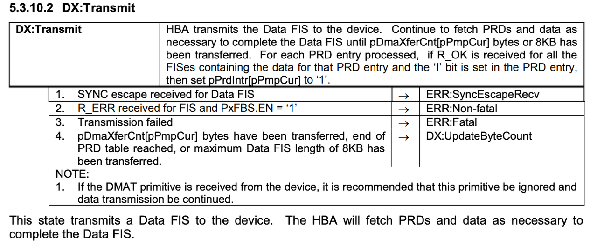

\newpage{}

# 存储基础 {#intro-to-store}

## 硬盘与操作系统 {#harddrives-and-os}

大家都知道数据是存储在硬盘上的，这篇文章会重点讨论硬盘与操作系统是如何交互的，这部分的讨论侧重于软件的讨论，硬盘还有一些值得注意的硬件特性，例如高延迟、随机读写性能差、读写放大等特性，会在另外的文章中讨论。

### 操作系统如何认识硬盘 {#how-os-recongize-hdds}

目前，硬盘已经有多种不同的物理接口，消费级硬件中主流的是 SATA 和 NGFF (M.2) 接口的硬盘，SATA 接口的硬盘几乎一定默认使用 AHCI 协议与操作系统进行交互，而 NGFF 接口的硬盘可能会存在支持 AHCI 和 NVMe 两种不同协议的硬盘，彼此之间不互相兼容。

本文要讨论的是操作系统与硬件交互的标准方式，也就是类似软件上接口(interface)的概念，因此本文主要讨论的是AHCI或者NVMe，而不是SATA或者NGFF。

### 操作系统对硬盘的抽象 {#abstraction-of-hdds}

以 AHCI 协议为例，AHCI 协议是 Intel 牵头制定的，官方有详细的协议规范： https://www.intel.com/content/www/us/en/io/serial-ata/serial-ata-ahci-spec-rev1-3-1.html

这份规范是非常底层的，直接说明了操作系统与硬件如何交互：

```{r ahci-standard, fig.cap='规范中对数据FIS传输的说明', out.width='75%', echo = FALSE}

```

抽象来说，AHCI 包括了一些命令，操作系统可以通过操作内存来调用这些命令，下面是我抽象的几个指令：

| 指令                | 作用                                                         |
| ------------------- | ------------------------------------------------------------ |
| Read Sector         | 用来读取一个或者多个扇区的数据                               |
| Write Sector        | 用来写入一个或者多个扇区的数据                               |
| Identify Device     | 获取设备描述信息                                             |
| Flush Cache         | 强制硬盘将缓存中的数据写入到盘上                             |
| Standby Immediate   | 提示硬盘从待机状态恢复到工作状态                             |
| Idle Immediate      | 提示硬盘从工作状态切换到低功耗待机模式                       |
| Data Set Management | 用来提示硬盘进行TRIM等操作（SSD和Host managed SMR盘常用）    |
| Read FPDMA Queued   | 将一个读取指令加入到硬盘本地的队列中，硬盘可以乱序执行队列中的指令来获得最佳性能 |
| Write FPDMA Queued  | 将一个写入指令加入到硬盘本地的队列中，硬盘可以乱序执行队列中的指令来获得最佳性能 |

其中的很多指令都很容易理解，例如`Read Sector`，就是读取数据的指令，`Idle Immediate` 是对硬盘电源状态进行管理的指令，我想，读者可能会对`Data Set Management` 这一指令的作用有些困惑，这里就对这个做一下展开解释。

SSD 和 Host-Managed SMR 硬盘有一个特性：**在写入数据前必须先擦除掉这部分的数据，而擦除需要花费不少时间**。因此，操作系统可以通过这些指令在文件删除时就通知 SSD：这片区域不再使用了，**SSD 就会在空闲时进行擦除操作**，节省下次写入时需要的时间。这种操作可以认为是一种垃圾回收过程，不过需要注意其与内存管理中的垃圾回收有明显区别。

除了对 AHCI 的底层命令进行抽象封装外，操作系统还进行了一系列额外的工作，这部分工作视操作系统的不同而不同。例如，在 Linux 系统中，所有的硬盘都被抽象为块设备：

```COBOL
# lsblk
NAME   MAJ:MIN RM  SIZE RO TYPE MOUNTPOINTS
sda      8:0    0   20G  0 disk 
├─sda1   8:1    0  476M  0 part /boot
└─sda2   8:2    0 19.5G  0 part /
```

通过上面的命令可以看出，在这台系统上有 20G 的硬盘，这块硬盘分为 2 个分区，被 Linux 系统识别为`sda`的块设备。

下一节，我们简单聊一聊 Linux 系统中的“块设备”的特性和使用方法。

### 块设备(Block device) {#block-device}

为什么 Linux 系统将硬盘抽象成块设备？块设备是什么含义？

块设备在 Linux 系统上是指能够按照固定大小的块进行数据存取的设备，例如，对于扇区大小是 512B 的硬盘来说，块的大小就是 512B ，在 Linux 系统上，下面所有的设备都是块设备：

| 设备名称     | 设备类型              |
| ------------ | --------------------- |
| /dev/sdX     | AHCI设备              |
| /dev/sr0     | 光驱                  |
| /dev/hdX     | IDE设备               |
| /dev/nvmeX   | NVMe设备              |
| /dev/mmcblkX | MMC设备(eMMC或者SD卡) |

在 Unix 系统中，一切都是文件，因此，块设备作为文件也实现了文件的基本接口，可以被标准的文件 API 读取和写入：

```COBOL
# sudo head -c 8 /dev/sda
?c??м#                             
```

以上的命令使用 head 工具读取了硬盘最开始的 8 个字节的数据，当然了，展示出来的是乱码，因为这些二进制数据不是用 ASCII 编码的。
