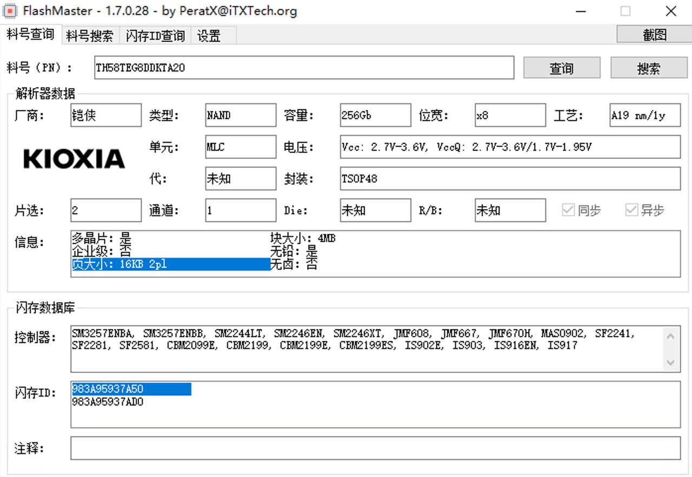

\newpage{}

## SSD特性与随机读写性能 {#ssd-characteristics-and-random-io}

在之前的一定篇幅中，简单介绍了机械硬盘的基本特性，这篇文章会补充介绍 SSD 的相关特性，另外还包括一个小实验，用于验证硬盘的性能，让读者对硬盘性能有进一步感性的认识。

很多人认为，由于有了 SSD ，数据库的性能相比机械硬盘就相差无几了，甚至认为，对 SSD 可以任意进行读写而不必考虑优化，诚然，SSD 相比机械硬盘的提升是指数级的，但这并不意味着 SSD 本身的特性上没有明显的问题和需要注意的地方。

在开始之前，我还要补充一个关于存储的基本知识。

什么是随机存储器，什么是非随机存储器呢？

其实，在这块并没有很明确的定义，随着闪存的普及，硬盘也可以在某种程度上认为是一个“随机访问存储器”，但我还是要指出，SSD 所使用的 NAND Flash 和 DRAM 为代表的“随机访问存储器”有着明显的区别。

我在这里明确定义：如果一个存储器，可以按照处理器的“字” (WORD) 为单位进行随机读写，那么它就是随机存储器，反之，它就不是。

```{r page-size-of-different-storages, fig.cap='不同存储器最小读取大小的对比', out.width='75%', echo = FALSE}
knitr::include_graphics('./images/intro-to-store/page-size-of-different-storages.png')
```

根据上述定义，抛开 Optane 等新兴的非易失性内存不谈，**我们的硬盘都是不支持随机访问的，不论是机械硬盘还是 SSD ，都不支持随机访问。用之前的文章中提到的概念来说，块设备都是不支持随机访问的。**这是由它们的硬件特性决定的。

关于机械硬盘为什么随机性能很差，之前已经介绍过，这里补充介绍 SSD 的特性：

SSD 的底层使用的存储介质是 NAND Flash，NAND Flash 的最小读取单位是一个 Page ，而最小重编程单位更是达到了一个 Block ，这意味着，对 SSD 来说，每次最小读取一个 Page (越是新的 NAND Flash 页大小越大，10 年前 (2013) 的主流 Page Size 是 8K) ，而每次更新数据时的最小写入单位更是达到了一个 Block ，通常是 64~128 个 Page （随着闪存容量变大，这个值还会变大）。

```{r page-size-of-8ddk, fig.cap='2015年量产的TH58TEG8DDKTA20闪存的页大小已经高达16KB', out.width='75%', echo = FALSE}

```

```{r organization-of-nand-flash, fig.cap='Nand Flash结构示意图，图源AnandTech', out.width='75%', echo = FALSE}
knitr::include_graphics('./images/intro-to-store/organization-of-nand-flash.png')
```

而，如果我们要随机读取大量的小文件，造成的读写放大都是巨大的。如果 SSD 每次最小读取 64KB ，而要读取的数据大小是 4K，那么就存在 16 倍的读取放大。

这里，我们可以简单写一个程序来测试硬盘的随机 4K 读取性能，可以看到，对于 OS 无法进行预读缓存的随机 4K 读取，即使是在 SSD 上也存在巨大的性能损耗。

```Python
import os
import random

class IOBenchmark:
    def __init__(self):
        self.RANDOM_FILE_NAME = "random_file.pytest"
    def createRandomFile(self, sizeInMegaByte=1024):
        with open(self.RANDOM_FILE_NAME, 'wb') as fout:
            fout.write(
                os.urandom(sizeInMegaByte * 1024 * 1024))
            fout.flush()
            os.fsync(fout)
    def random4KRead(self, ioOperations = 30000):
        import time
        with open(self.RANDOM_FILE_NAME, 'rb') as fin:
            t0 = time.time()
            for i in range(ioOperations):
                fin.seek(random.randint(0, os.stat(self.RANDOM_FILE_NAME).st_size))
                fin.read(4096)
        print("Performed {0} iops 4k random read in {1} seconds".format(ioOperations, time.time()-t0))

if __name__ == '__main__':
    ioBench = IOBenchmark()
    # ioBench.createRandomFile()
    ioBench.random4KRead()
```

仅仅是进行 30000 次随机的 io 读写，性能如何呢？这里我在 SATA 的固态硬盘上做了个简单测试

```{r benchmark-of-30000-random-4k-read, fig.cap='30000次随机4k读取测试', out.width='75%', echo = FALSE}
knitr::include_graphics('./images/intro-to-store/benchmark-of-30000-random-4k-read.png')
```

可以看到，仅仅是 30000 次的随机读，就要花费 5.6秒 的时间。折算下来的读取速度大约是 20MB/S ，这符合 SATA SSD 的典型性能表现

除了介质本身存在如此大的读取放大损失外，设备本身的响应时间也十分慢。永远记住，假设 CPU 从 L1D 取数据的速度是 1 秒，那么 CPU 从 SSD 取数据的时间大约是 1 天。
