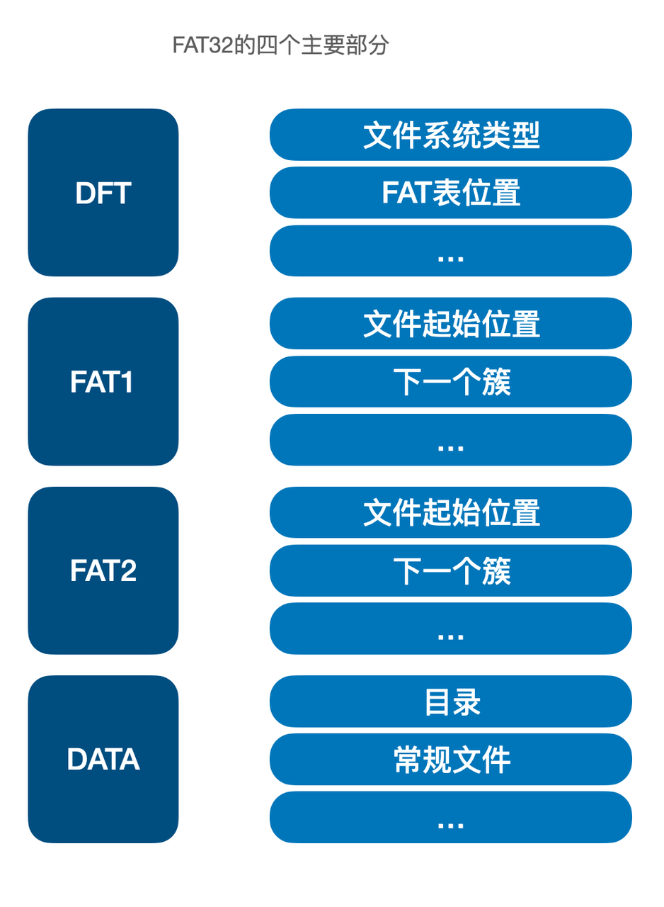
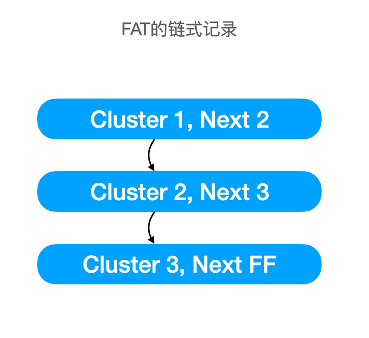

\newpage{}

## 文件系统 {#filesystem}

在之前的文章中，简单介绍了硬盘与操作系统交互的方式。读者现在应该已经认识到硬盘可以被抽象为一个“块设备”，并且对硬盘的硬件特性有了一些了解。但仅仅这样距离硬盘可以被用在实际使用中还有一些距离。举例来说，有下面这些关键的问题没有解决。

很显然，作为用户，我们不可能直接去操纵硬盘并记忆数据的地址。那么：

- 用户如何决定要将数据存储在哪里？
- 用户如何快速索引出之前存进硬盘里的数据？

为了解决这些问题，需要文件系统的支持。

文件系统决定了用户的数据在硬盘上的组织方式，不同的操作系统有不同的文件系统，比如，Windows 常用的文件系统是 NTFS ，Linux 系统比较常用的文件系统是 EXT4 。每个文件系统的特性都有不同，不同的文件系统适应不同的使用场景。下面我会简单介绍一下文件系统的基本常识。

### FAT32简介 {#introduction-to-fat32}

上文简单介绍了文件系统的概念，但可能没有办法帮助读者建立起具象的印象，因此，在这一小节我会选取一个简单的文件系统作为例子来讨论它是如何工作的。

这里，我直接引用 FAT32 文件系统的结构。FAT32 是微软在上世纪 90 年代推出的文件系统，在早期曾经作为 Windows XP 等系统的系统分区默认文件系统，但现在已经几乎完全淘汰，只有少数的可移动存储设备在使用 FAT32 文件系统，FAT32 是 FAT (File Allocation Table, 文件分配表) 文件系统的 32 位版本，是这一系列文件系统的最后版本，从这个文件系统的名字也可以看出来，这种文件系统相对是比较原始的，很适合用来举例子和学习。

```{r organization-of-fat32, fig.cap='FAT32的四个主要部分和其作用', out.width='75%', echo = FALSE}

```

### 簇 {#clusters-of-fat32}

在 FAT32 文件系统中，管理存储数据的最小单元是“簇”，一个簇的大小是扇区的 2^n 倍，举例来说，一个簇可以是 2个、4个、8个...64个 扇区。 FAT32 将最小管理单位定位可变的簇，**主要原因是扇区这一硬盘的原始单位实在是太小，仅仅只有 512 个字节，如果使用扇区来作为文件系统中文件的地址直接使用，不仅会更多地占用文件分配表（文件分配表直接记录了文件的簇地址），还容易出现更多的文件碎片（即，一个文件被打散在多个不连续的簇上，影响读写性能）。根据簇的定义，一旦给定了某个文件系统的簇的尺寸，就可以根据簇的编号直接定位到簇所在的扇区。**

### FAT {#file-allocation-table}

FAT32 管理文件位置的工具被称为文件分配表（FAT），**文件分配表是一段固定大小的空间，和数据区的簇的数量一一对应**，有多少个簇，文件分配表中就有多少条记录。而每条记录在文件分配表中占 32 个比特，这也是 FAT32 这一名字的由来。

文件分配表的作用是用来在提示对应的簇上有没有文件，以及对应的簇存储的文件是在簇内就结束了，还是需要再读取下一个簇来读取下一部分。因此，文件分配表可能看起来像是这样：

```{r links-in-fat, fig.cap='FAT的簇链', out.width='75%', echo = FALSE}

```


### 目录管理 {#directorys-in-fat32}

目录（文件夹）可能在一些读者眼中是一种相对特殊的概念，读者可能认为目录没有办法作为普通文件来管理。事实上，在 FAT32 中，目录和普通文件的管理方式完全一致，这也大大降低了文件系统的复杂度。

在 FAT32 文件系统中，目录也是一种特殊的文件，这种文件上记录着文件夹下对应有哪些文件和它们对应的簇，和其他文件一样，如果一个簇存不下所有的文件信息，那么就可以在 FAT 表新增一条记录接着记录。

### FAT32的灾难恢复 {#recovery-of-fat32}

FAT32 文件系统包括四个部分：DBR 、FAT1 、FAT2 和 数据区。其中，DBR 是一段固定大小的区域，这块区域主要记录用来加载文件系统所必需的信息，例如文件系统的类型、簇的大小、FAT 的起始位置等，有了这些信息，文件系统驱动才能准确地识别出文件系统。关于 DBR 和 FAT 的作用，之前已经说明，现在主要说明 FAT2 的作用，以及 FAT32 文件系统如何在崩溃中恢复：

FAT1 和 FAT2 是两份完全一样的文件分配表，之所以保留 2 份，**是为了当出现 FAT1 损坏的时候可以用 FAT2 进行替换**。FAT2 是 FAT32 恢复机制的一部分。

读者可能想到，FAT2 中的数据不一定是最新的，**这也就意味着尽管文件系统可能会恢复，但是用户已经写入的文件有可能会丢失，已经删除的文件也可能又出现。**为了避免这一问题，有对应的被称为 chkdsk 的工具。**这一工具会对 FAT32 全盘进行扫描，而不是依赖 FAT 来进行文件的发现。**当它扫描到实际存在但在 FAT 中不存在的文件时，就会将它们添加到 FAT 中，以前的操作系统里在分区的根目录通常会有 `LOSTFOUND.000` 的目录，这一目录的作用就是存储 `chkdsk` 扫描全盘发现的文件。这就是 FAT32 的崩溃恢复过程。
