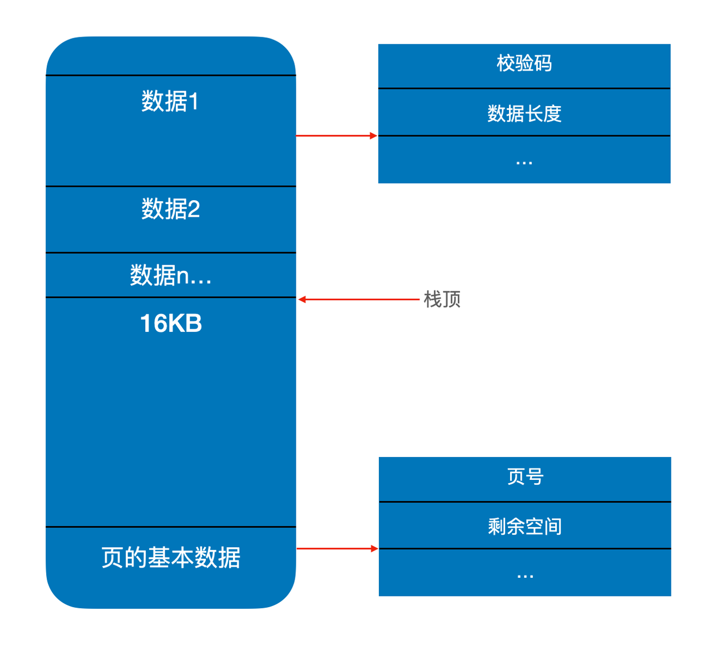
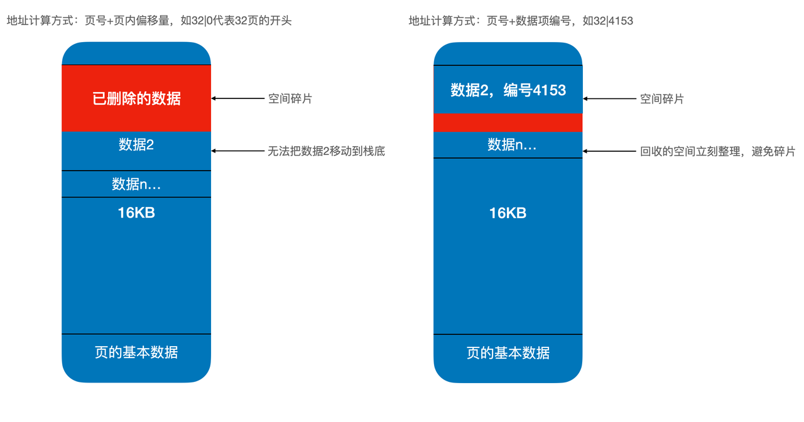
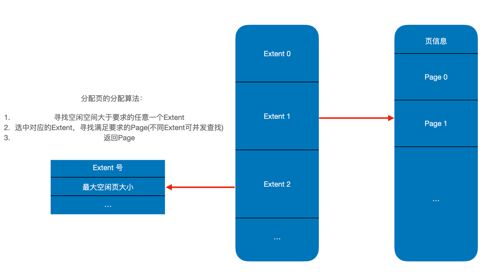

\newpage{}

## 一个简单的存储层设计 {#storeage-layer-of-dbms}

在前文，对存储层设计需要考虑的方面进行了简单的介绍。在这一节，尝试着从零开始设计一个简单的数据库存储层，并介绍设计背后的各种考虑。

### 寻址与分页 {#addressing}

首先应该意识到，不论我们的存储层设计如何，我们都需要一个方式来表示数据存储的位置，也就是数据的地址。

理论上来说，我们可以使用从文件起始位置到数据开始位置的 offset 作为地址，但是这种方式对硬盘并不友好。如前文\@ref(ssd-characteristics-and-random-io)所述，硬盘本身就是有读取放大的，因此，基本可以认为，一次性读取的数据一定要大于 4K，否则会造成很大的读取放大，也不会对性能有什么帮助，对新的 SSD 来说，一次性读取的数据可以更大，可以采用激进的64K等方案。

```{r paging, fig.cap='分页示意', out.width='75%', echo = FALSE}
knitr::include_graphics('./images/database-storage/paging.png')
```

既然有了最小读取大小的限制，这就必然要求我们对地址空间进行分页了，分页的大小，以 MySQL 为例，设置在 16KB。

### 页内空间管理 {#space-managing}

在明确了使用分页的方式来方便寻址之后，我们需要意识到，一个页的大小（16KB或者更大）对于存储单纯的一条数据来说可能还是太大了。有没有办法，更好地来管理空间，提高空间的利用率呢？

这就涉及到业内空间的管理方式了，在这里，我们使用常见的方式，在页的底部存放与页的信息相关的重要数据，并且让分配给用户的空间从页的顶部开始向下增长，下面是空间管理的示意图。

```{r space-managing, fig.cap='页内空间管理示意图', out.width='75%', echo = FALSE}

```

需要指出的是，这种地址管理方式存在一个潜在的缺陷，有一定改进的空间：

在这种地址管理方式中，数据的起始位置由 页号+在页内的偏移 共同确定。这种方式中，如果需要对页的数据进行部分的空间回收，就不能移动其他项所在的地址，因为这会导致在其他地方记录的数据地址不准确。

一个可能的改进是，我们可以不使用页内偏移，而是给数据项一个编号，每次读取数据时，把整个页读出，随后找到编号相符的数据项即可。

```{r fragments-in-page, fig.cap='不同地址表示方式造成的空间碎片', out.width='75%', echo = FALSE}

```

### Extent {#extent}

分页制能够避免读写放大造成的硬盘性能浪费，但一个页通常只有 16KB，其实是相对较小的，存几条用户数据就不够用了。为了保证 Data locality，也就是尽可能使会被一起使用的数据在硬盘上的位置相邻，这里我们还需要引入另一个概念——Extent。Extent 的实质是利用空间预分配这一手段，来为后续可能的邻居留出空间，以此来促进数据局部性。

每个 Extent 由可以配置数量的 Page 组成，通常一个 Extent 包括 1000-2000 个 Page。

除了保证数据局部性之外，Extent 这一设计还有一个比较重要的作用，有利于提高空间分配算法的并发度，每个 Extent  都会维护一个自己所包含的 Page  的空闲情况，当用户需要分配一个空间时，系统会快速索引出一个能够满足需求的 Extent ，随后，用户的请求会被分配到具体的 Extent  去执行，从而避免了所有的用户请求都在等同一个地方分配空间的问题。

```{r page-allocation, fig.cap='Extent和空间分配算法', out.width='75%', echo = FALSE}

```

### Copy On Write 优化 {#copy-on-write}

最后，来提空间分配之外的一个优化手段。

前文提到，变长数据的处理是相对复杂的，那么怎么简化这个过程呢？

可以使用名为 CoW 的方案来简化相关过程，在这个方案中，**每个数据项的长度在被创建时就是固定的，事后不可以再被修改。**

需要注意的是，**我们这么设计并没有断绝了数据项在日后扩展长度的可能**，如果需要一个空间更大的数据项时，可以先分配一个更长的空间，复制原数据项的信息到新的空间中，这样就能够扩展数据项的长度。这样一来，我们实际上把数据变长变成了分配空间-回收空间的过程，简化了管理。

这种做法经常被称为Copy On Write，或 CoW，写时复制。这种做法在一些文件系统中也有涉及，例如 btrfs 默认使用的就是 CoW 机制。此外，由于 SSD 这类硬件的特性，写入和擦除操作是分离的，通常 SSD 的固件会避免原地擦除后重新写入数据，因为这种操作会对同一个闪存块造成过度损耗。SSD 的主控会从已经擦除的块中选择一个磨损较小的，将原先的数据复制出来并写入进去，也就是说，**SSD 这类硬件在底层天然执行的就是 Copy On Write 机制**。
