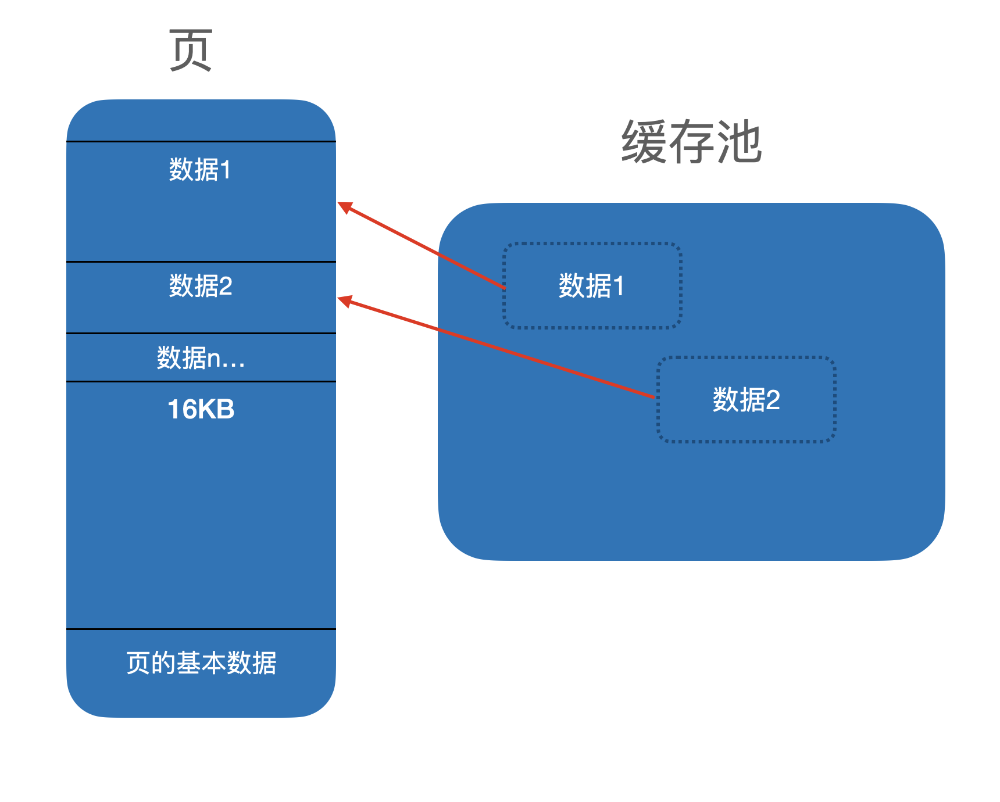

\newpage{}

## 缓存池

前文\@ref(storeage-layer-of-dbms)介绍了数据库的一个基本物理存储结构。在这个部分之上，缓存池是一个极其重要的部分。本文来对缓存池的作用和原理做一些简单介绍。

### 预读和重复利用

缓存池顾名思义的第一个作用就是将可能要用到的数据先缓存起来，这样当用户需要使用这部分数据的时候就可以直接从内存中拿到，而不用再回到硬盘挨个读取。

以前文中提到的存储结构为例，缓存池在读取文件的时候，可以将整个`Page` 的数据全部读取出来，避免多次重复读取。
另外，已经使用完毕的数据也可以保留在缓存池中一段时间，避免重复读取硬盘。

```{r dataelements-in-bufferpool, fig.cap='缓存池与页中数据', out.width='75%', echo = FALSE}

```


### 异步刷盘

缓存池还负责异步刷盘的管理。如前所述，我们的硬盘喜欢顺序写入操作，对于随机写入操作，实际上，所有的写入动作也是直接进入缓存池的，也就是说，所有对数据的写入操作默认都是在内存中进行的。当缓存池满，需要淘汰数据，或者按照一定的策略需要触发刷盘时，缓存池需要给出目前还没有刷盘的数据列表，并负责对这些数据进行刷盘。

### 并发控制

最后一个很重要但很少有人提及的点是，缓存池在绝大多数的数据库系统中都负责 Latch 的管理。在数据库系统中，通常有 2 种不同的锁，第一种被称为 Lock ， 第二种被称为 Latch 。 其中，Lock 更多是对外的概念，例如，对某一行数据的一个锁，这种锁是具有业务意义的，Lock 依附于事务存在，甚至可能存在死锁等复杂场景，需要长时间保有。

而，Latch 是数据库内部的锁，Latch 负责进行最基本的数据库组件的并发管理，并不关心事务等概念，每个 Latch 的生命周期也很短，不会有持续时间和事务一样长久的 Latch 出现。举例来说，在 B+ 树的插入时，需要对 B+ 树的节点加锁，这时加的锁就是 Latch 而不是 Lock。

分清 Latch 和 Lock 是十分重要的，数据库对外展现的所有和锁有关的概念，例如“行锁”，都是 Lock 实现的概念，而 Latch 是用来保证数据库自身在并发状况下正确性的锁，对外不能观测到，所有的 Lock 的实现都应该不依赖 Latch 进行，否则就意味着长事务等会直接拖慢数据库自身的运行速度。

如何理解利用缓存池来实现 Latch 呢？举例来说，在我们的设计中，缓存池会保证每一个页中的数据项都是全局唯一的，用户通过地址取数据项时，总是会返回缓存池中的同一个对象，用户对数据项加锁时，其他要读写这个数据项的线程也能感受到。

通过这种保证，数据库在数据项这一最小的数据单元上就实现了并发控制，上层的其他内容，例如 B+ 树的节点，底层都绑定了一个数据项，通过对数据项加锁，我们实际上可以实现对 B+ 树节点的锁。

可以指出，Latch 和 Lock 尽管在概念上区别很大，但在实现上并不一定有很大的区别，举例来说，大部分数据库的 Latch 都是直接依赖操作系统提供的多线程同步工具(信号量、mutex 等)来进行的。Lock 的实现多种多样，但也可以通过简单的 mutex 来进行。

### 缓存池的设计

缓存池的设计，有两个需要注意的点，一个是保证缓存池的正确性，不要淘汰掉不应该淘汰的数据，另一个则是讨论如何高效地淘汰数据

#### 正确性

有一些数据，在缓存满时也是不能淘汰的。这一类数据简单来说就是还有人在使用的数据，具体来说，就是还有线程持有对这个数据的 Latch 的数据，缓存池在实现时应该充分考虑这种情况，避免淘汰使用中的数据引起程序错误。

那么，缓存池如何知道一个数据是否还有人在使用呢？我们认为，我们可以设计一种缓存池数据的使用协议，并保证所有的使用方都需要遵守这个协议，只要遵守了这个协议，缓存池就能保证其行为的正确性。

#### 使用协议

接下来，我们来设计这样一个基本的协议，首先来分析几种数据在缓存池中的不同场景，按照是否有使用方、是否有数据变更，可以分为以下三种场景：

- 没有使用方，没有数据变更

对于这种情况，缓存池可以直接淘汰数据，不需要做任何额外的操作

- 没有使用方，有数据变更（与磁盘上的数据有差异）

对于这种情况，缓存池可以淘汰数据，但必须在淘汰数据前把数据落盘，不然下次读取数据的时候就会读到脏数据

- 有使用方

对于这种情况，不论有没有数据变更，缓存池都不能淘汰数据

我们要设计的“协议”，其实就是规范使用方调用缓存池的方式，让缓存池能够知道，有没有使用方、有没有数据变更。

因此，协议可以这么设计：

- `obtain()` 在使用数据前，使用方必须调用 `obtain()` 方法，这个方法会给缓存池内部维护的数据引用计数 +1，缓存池确保在引用计数清零前不能淘汰数据
- `release()` 当使用完成后，使用方必须调用 `release()` 方法，这个方法与 `obtain()` 做的事情相反
- `commit()` 当使用方修改数据后，必须调用 `commit()` 让缓存池知道数据已经被修改

只要遵守了上述协议，缓存池就能够正确发挥作用。

#### 缓存池的淘汰策略

接下来，讨论缓存池的不同淘汰策略。

##### FIFO

FIFO 是指先入先出的淘汰策略，这种策略极其简单，你可以把缓存池视为一个队列，新加入缓存池的数据项位于队首，而第一个加入缓存池的数据项位于队尾，当缓存池满时，队尾就会第一个被淘汰出去。

FIFO 是一种极其简单的淘汰策略，在一些情况下也确实好用，但是在数据库场景下有一些不足，这里讨论这些问题：

1. 短期热点问题：FIFO 可能会导致一些短期内频繁使用的数据被淘汰。比如，某一数据项短时间内被多次访问，但因为其入队列的时间较早，可能会被淘汰，导致未来再次访问时又需要从磁盘读取。
2. 不适应复杂的访问模式：数据库中的数据访问模式非常复杂，有的数据可能周期性地被访问，而有的数据长时间没有被访问后可能很快就会被再次访问。FIFO 策略并不考虑这些模式，可能导致频繁的磁盘IO。

为了解决上述问题，我们需要考虑我们实际应用场景的数据访问模式，例如，如果存在短期热点的场景，通常使用 LFU (Least Frequently Used) 策略，来保证经常访问的数据不会被缓存池淘汰，而如果是顺序扫描数据的场景，可以使用 LRU (Least Recently Used) 策略来保证长时间没有访问到的数据会被缓存池淘汰，而最近访问过的不会。

##### LRU (Least Recently Used)

LRU 是基于数据的历史访问记录来决定哪些数据被淘汰的策略。它会淘汰最长时间未被访问的数据。例如，某项数据一直被读取，那么它就不会被淘汰，这比 FIFO 要好得多。

具体来说，当一个数据项被访问时，LRU 会将其移动到缓存池的最前端，当需要淘汰数据时，LRU 会选择最后端的数据进行淘汰，因为它是最长时间未被访问的。

通过上面的描述，读者可以大概猜到，LRU 可以使用链表来实现，每次某数据被访问时，就把它移动到链表头部，每次需要淘汰数据时，就从链表尾部开始淘汰。

LRU 虽然对 FIFO 做了改进，但是依然不善于应对周期性的读取模式。

##### LFU (Least Frequently Used)

LFU 基于数据的访问频率来决定哪些数据被淘汰。它会淘汰访问频率最低的数据。

基于 LFU 的缓存池维护了一个频率计数器，每当数据项被访问时，其对应的频率计数器增加，当需要淘汰数据时，LFU 选择频率最低的数据进行淘汰。

LFU 能够很好地处理长期的访问模式。即使一个数据项在短期内没有被访问，但只要它的长期访问频率足够高，它仍然可以保留在缓存中，也就是说，对于有明确访问热点的工作负载，LFU可以提供非常好的性能。

LFU 的最大问题是，实现起来比较复杂，计算淘汰元素时需要耗费较多的 CPU 时间，对于要求性能的缓存池来说，有时候并不合适。

总结来说，选择哪种缓存淘汰策略应根据具体的应用场景和工作负载来决定。在某些情况下，可能需要结合 LRU 和 LFU 的特点，使用如 LRU-K 或 SLRU 等混合策略来达到最佳效果。

##### 时钟算法

接下来，介绍一种工程上常用的 LFU 近似算法。

时钟算法通过维护一个循环链表（形象地称为“时钟”）来模拟最近使用情况，每个节点代表一个缓存页，并且每个节点有一个使用位（通常称为“时钟指针”）。下面是时钟算法的基本流程：

1. 初始化：创建一个循环链表，链表中的每个节点代表一个被缓存的数据，每个节点都有一个使用位（标志位），初始化时，所有节点的使用位都设置为0。
2. 访问页面：当访问一个页面时，如果该页面已在缓存中（即在循环链表中），则将该页面对应节点的使用位设置为1（表示该页面最近被使用过）。
3. 替换页面：当需要载入一个新页面而缓存已满时，时钟算法会查看当前时钟指针指向的节点：
   1. 如果该节点的使用位为1，则将它设置为0（表示该页面不再是最近使用），然后时钟指针向下移动到下一个节点。
   2. 如果该节点的使用位为0，则将当前页替换为新的页面，并将新页面的使用位设置为1，同时保留时钟指针位置。

这个过程像一个时钟一样不断循环，因此得名“时钟算法”。

时钟算法通过“使用位”的概念赋予了经常被使用的数据逃过一劫的机会，同时，通过指针旋转的动作避免了将最近刚加入缓存池的数据淘汰出缓存，可以认为是一种近似的 LFU 算法
